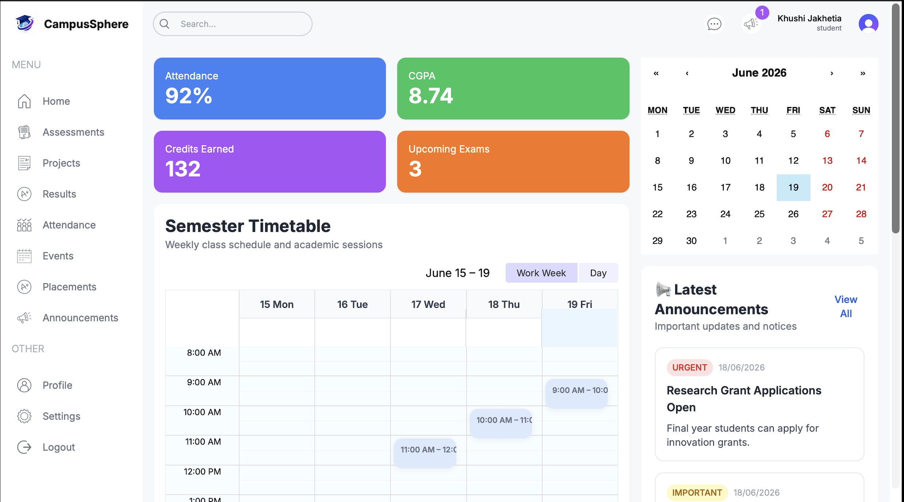
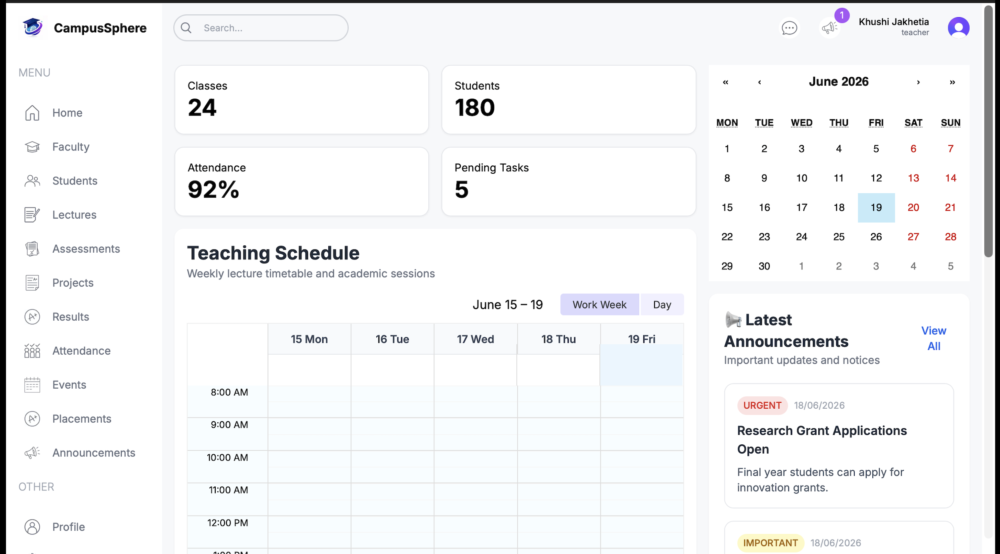
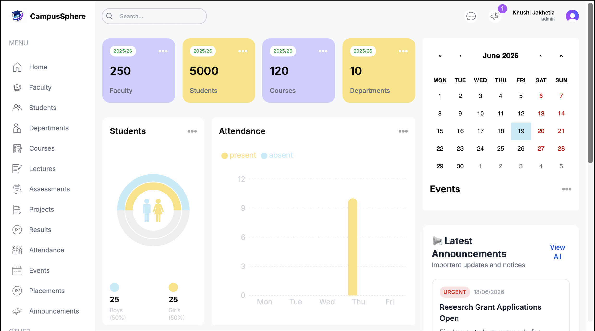

# 🎓 CampusSphere – University Management System

<p align="center">
  
</p>

<p align="center">
  🚀 Modern University Management Platform <br/>
  Student • Faculty • Administration • Academic Management
</p>

---

## ✨ Overview

CampusSphere is a full-stack university management system designed to streamline academic operations for students, faculty members, and administrators.

The platform provides centralized access to academic schedules, assessments, attendance, announcements, events, and role-based dashboards through a modern and responsive interface.

---

## 🚀 Key Features

### 👨‍🎓 Student Dashboard

- Semester Timetable
- Attendance Tracking
- Academic Results
- Assessment Management
- Announcements & Notices
- Upcoming Events

### 👨‍🏫 Faculty Dashboard

- Course & Lecture Management
- Student Records
- Attendance Monitoring
- Assessment Creation
- Academic Scheduling

### 👨‍💼 Admin Dashboard

- User Management
- Department Management
- Course Administration
- Event & Announcement Control
- Academic Data Monitoring

### 🔐 Authentication & Authorization

- Secure Clerk Authentication
- Role-Based Access Control
- Protected Routes
- Session Management

---

## 🛠️ Tech Stack

| Layer | Technologies |
|---------|-------------|
| Frontend | Next.js 14, TypeScript |
| Styling | Tailwind CSS |
| Database | PostgreSQL |
| ORM | Prisma |
| Authentication | Clerk |
| UI Components | React Big Calendar |
| Deployment | Vercel |

---

## 📚 Modules

- Student Management
- Faculty Management
- Course Management
- Assessment System
- Attendance Tracking
- Academic Timetable
- Announcements & Notices
- Events Calendar
- Role-Based Dashboards

---

## 📸 Screenshots

### Student Dashboard



### Faculty Dashboard



### Admin Dashboard



---

## ⚙️ Installation

### Clone Repository

```bash
git clone https://github.com/yourusername/CampusSphere.git
cd CampusSphere
```

### Install Dependencies

```bash
npm install
```

### Configure Environment Variables

Create a `.env` file:

```env
DATABASE_URL=your_database_url

NEXT_PUBLIC_CLERK_PUBLISHABLE_KEY=your_clerk_publishable_key
CLERK_SECRET_KEY=your_clerk_secret_key
```

### Run Development Server

```bash
npm run dev
```

Visit:

```text
http://localhost:3000
```

---

## 🌟 Future Enhancements

- AI Academic Assistant
- Student Analytics Dashboard
- Placement Management Module
- Fee Management System
- Mobile Application
- Real-Time Notifications

---

## 👩‍💻 Developer

**Khushi Jakhetia**

Electronics & Communication Engineering  
National Institute of Technology Bhopal

---

⭐ If you found this project useful, consider giving it a star on GitHub!